# Introduction
ModelingToolkitTolerances.jl is designed to help with the selection of `abstol` and `reltol` (see [stepsize control](https://docs.sciml.ai/DiffEqDocs/stable/basics/common_solver_opts/) for more info) when using ModelingToolkit.jl and DifferentialEquations.jl to solve models. These tolerances act on the error estimates computed when solving the model.  These error estimates are very abstract from the physics of the problem and are therefore challenging to set in some cases.  As can be seen from the documentation, the defaults for `abstol` and `reltol` are 1e-6 and 1e-3, respectively.  If these defaults give a bad result, how should they be adjusted?  It's very difficult to know what to do in this case, and that is where ModelingToolkitTolerances.jl seeks to help.  

Furethermore, in some cases it's sometimes obvious if a model solution was good or bad, but in other cases the question arrises: What is the quality of the model solution?  What is it's "error"?  With the knowledge that we have from a ModelingToolkit.jl model in addition to the power of Automatic Differentiation, we can now solve for the model error, and even check the error of each solved equation, whether it was algebraic or differential.  Let's explore an example of how this works.

# Example
## How to explore tolerance settings
Take the following hydraulic model of a pressure source, connected to a fixed volume with a valve.  The valve starts closed and then opens with a linear ramp.  We would expect to see the pressure in the volume rise smoothly, quickly and then slowly, in an S shaped ramp, tabling off at a constant pressure matching the source.  


Let's see what we get when we solve this model...

```julia
using ModelingToolkit, OrdinaryDiffEq
using ModelingToolkit: t_nounits as t, D_nounits as D
import ModelingToolkitStandardLibrary.Hydraulic.IsothermalCompressible as IC
import ModelingToolkitStandardLibrary.Blocks as B

using Plots

function System(; name)
    pars = []

    systems = @named begin
        fluid = IC.HydraulicFluid()
        src = IC.FixedPressure(; p = 10e5)
        vol = IC.FixedVolume(; vol = 5, p_int=1e5)
        valve = IC.Valve(; Cd = 1e5, minimum_area = 0)
        ramp = B.Ramp(; height = 0.1, duration = 0.1, offset = 0, start_time = 0.1, smooth = true)
    end

    eqs = [connect(fluid, src.port)
           connect(src.port, valve.port_a)
           connect(valve.port_b, vol.port)
           connect(valve.area, ramp.output)]

    return ODESystem(eqs, t, [], pars; name, systems)
end

@mtkbuild sys = System()
prob = ODEProblem(sys, [], (0, 5))
sol = solve(prob, Rodas5P()) # <-- using default abstol=1e-6 & reltol=1e-3
plot(sol; idxs=sys.vol.port.p, ylabel="pressure [Pa]")
scatter!(sol.t, sol[sys.vol.port.p]; label="solution points")
```

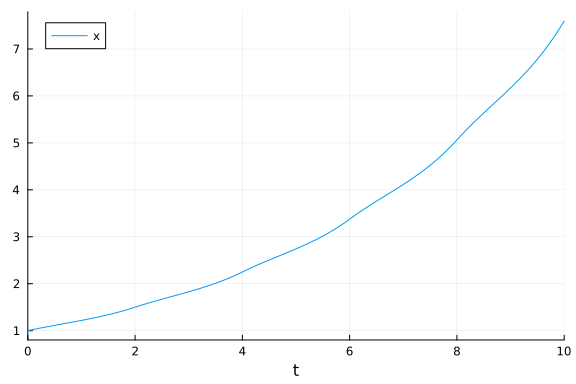


What we see here is a very strange solution which seems to be unstable.  Clearly we have an invalid solution.  Let's use ModelingToolkitTolerances.jl to see what the model error is...

```julia
using ModelingToolkitTolerances
resid = residual(sol, 0:0.01:5)
plot(resid)
```

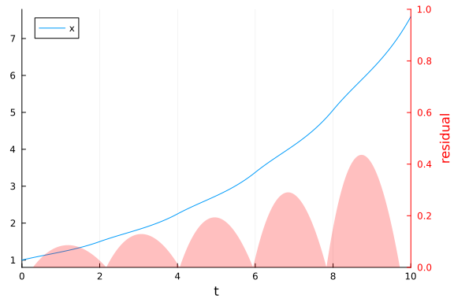


As can be seen, the error or residual of the model is quite larger than 0.  A perfect solution (i.e. an analytical solution) to the problem would give a residual of 0.  We can see then that this solution, as expected, is not high quality.  So what should we do to get a better solution?  Let's use ModelingToolkitTolerances.jl to explore what we can do using the `analysis` function...

```julia
resids = analysis(prob, Rodas5P())
```

```
Summary of Max Residuals
┌────────┬────────────────┬─────────────────┬─────────────────┬──────────────────┐
│ abstol │ reltol = 0.001 │ reltol = 1.0e-6 │ reltol = 1.0e-9 │ reltol = 1.0e-12 │
├────────┼────────────────┼─────────────────┼─────────────────┼──────────────────┤
│  0.001 │           12.2 │            1.96 │           0.774 │             0.78 │
│ 1.0e-6 │           12.2 │            2.14 │           0.049 │   *** 0.0112 *** │
│ 1.0e-9 │            N/A │             N/A │             N/A │              N/A │
└────────┴────────────────┴─────────────────┴─────────────────┴──────────────────┘
```


In plotted form...
```julia
plot(resids)
```

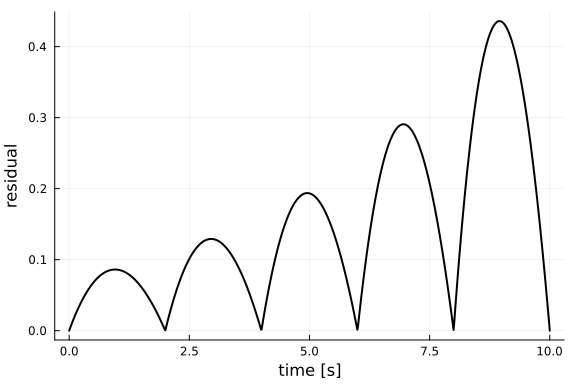


What we see here is that we need to adjust the `abstol` and `reltol` to 1e-6 and 1e-9 to get the residual to as close to zero as possible.  Let's apply that and 
see the new result.

```julia
sol = solve(prob, Rodas5P(); abstol=1e-6, reltol=1e-9)
Plots.plot(sol; idxs=sys.vol.port.p, ylabel="pressure [Pa]")
Plots.scatter!(sol.t, sol[sys.vol.port.p]; label="solution points")
```

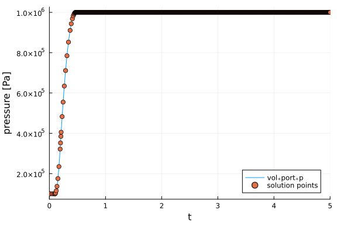


As can be seen we now get the expected smooth solution to a constant pressure.

# Work Precision
We can also get a work precision plot based on the calculated residual.

```julia
using ModelingToolkitTolerances: work_precision
work_precision(resids)
```

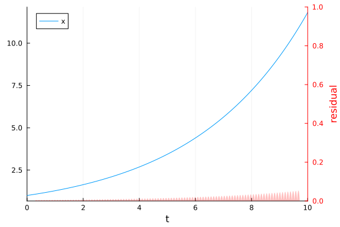


## Advanced Use
Note that we have used `@mtkbuild` which runs `structural_simplify()` on the model and reduces the 20 equation system down to 1 equation.  So what if we wanted to see the residual of each of those equations individually?  This might help us determine which equation is causing the model to struggle.  To do this we will use the function `no_simplify()`...

```julia
using ModelingToolkitTolerances: no_simplify

@named sys = System()
sys = no_simplify(sys)

st = unknowns(sys)
u0 = st .=> sol(0.0; idxs=st) # <-- create initialization from previous solution
prob = ODEProblem(sys, u0, (0, 1))
sol = solve(prob, Rodas5P()) # <-- using default abstol & reltol
Plots.plot(sol; idxs=sys.vol₊port₊p)
Plots.scatter!(sol.t, sol[sys.vol₊port₊p]; label="solution points")
```

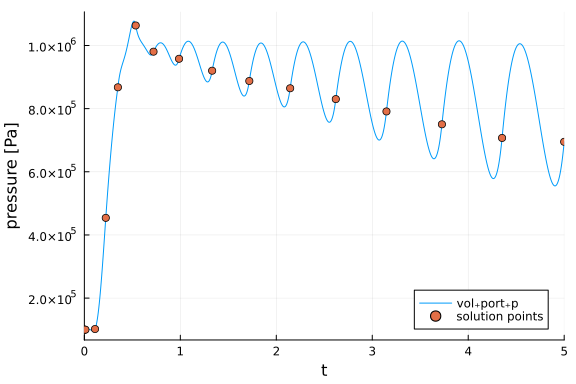


Here we get a very interesting solution, the adaptive time stepping is working more as expected with default tolerance.  Therefore this shows us that `structural_simplify()` is greatly influencing the solution.  Let's take a look at the residual...

```julia
resid = residual(sol, 0:0.01:1)
plot(resid)
```

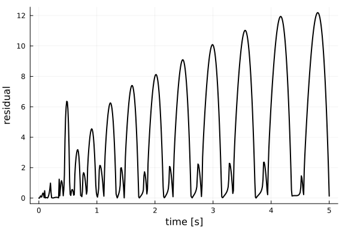


What we see here is the combined residual of all 20 equations.  If we want to look at the algebraic vs. differential equations, we can do the following...

```julia
using ModelingToolkitTolerances: ALGEBRAIC, DIFFERENTIAL

p1 = plot(resid, ALGEBRAIC)
p2 = plot(resid, DIFFERENTIAL)
plot(p1,p2)
```


As can be seen, all but 1 of the equations are algebraic.  And we can see that roughly one equation contributes to the total error, which is equation 9.  We can plot specific equations with the following...

```julia
using ModelingToolkitTolerances: ResidualSettings

plot(resid, ResidualSettings(9))
```

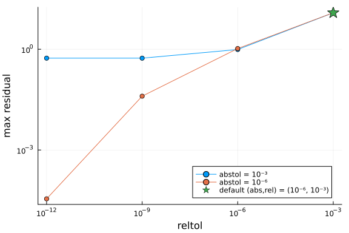


We can take a look at the equation...

```julia
eqs = equations(sys)

eqs[9]
```

```
0 ~ -valve₊base₊port_a₊dm(t) + ifelse(valve₊base₊area(t) > valve₊base₊minim
um_area, valve₊base₊area(t), valve₊base₊minimum_area)*ifelse(abs((200.0valv
e₊base₊port_a₊ρ*(valve₊base₊port_a₊p(t) - valve₊base₊port_b₊p(t))) / ifelse
((valve₊base₊port_a₊p(t) - valve₊base₊port_b₊p(t)) > 0, valve₊base₊Cd, valv
e₊base₊Cd_reverse)) >= 1, 0.1(abs((200.0valve₊base₊port_a₊ρ*(valve₊base₊por
t_a₊p(t) - valve₊base₊port_b₊p(t))) / ifelse((valve₊base₊port_a₊p(t) - valv
e₊base₊port_b₊p(t)) > 0, valve₊base₊Cd, valve₊base₊Cd_reverse))^0.5)*sign((
2valve₊base₊port_a₊ρ*(valve₊base₊port_a₊p(t) - valve₊base₊port_b₊p(t))) / i
felse((valve₊base₊port_a₊p(t) - valve₊base₊port_b₊p(t)) > 0, valve₊base₊Cd,
 valve₊base₊Cd_reverse)), (20.0valve₊base₊port_a₊ρ*(valve₊base₊port_a₊p(t) 
- valve₊base₊port_b₊p(t))) / ifelse((valve₊base₊port_a₊p(t) - valve₊base₊po
rt_b₊p(t)) > 0, valve₊base₊Cd, valve₊base₊Cd_reverse))
```


This is the valve equation, which is non-linear and makes sense that this is the biggest contributor to the error.  

# How ModelingToolkitTolerances Works
The concept of `ModelingToolkitTolerances` is quite simple.  From `ModelingToolkit`, we know the symbolic representation of the equations, therefore we know where the derivatives in the system are.  Using `ForwardDiff` and the `ODESolution` function, we can easily obtain  derivatives numerically.  Pair those 2 things together and it's easy to calculate the residual of all equations in a system.  

Take the simple convection cooling model...

```julia
T_inf=300; h=0.7; A=1; m=0.1; c_p=1.2
vars = @variables begin
    T(t)=301
end 
eqs = [
    D(T) ~ (h * A) / (m * c_p) * (T_inf - T)
]
@mtkbuild sys = ODESystem(eqs, t, vars, [])
prob = ODEProblem(sys, [], (0, 10))
sol = solve(prob, Tsit5())
plot(sol; idxs=T)
```


We are plotting the temperature, which should be smoothly cooling from 301K to 300K and reaching steady state.  But something in the numerical solution goes wrong and the temperature becomes unstable.  In this case we clearly have a measurable residual error in the solved equation.  The residual error is calculated simply as:

```julia
res = ( (h * A)/(m * c_p) * (T_inf - T) ) - ( D(T) )
```


From the numerical solution, we know `T`, but we don't have `D(T)`.  As mentioned, we can estimate this using `ForwardDiff`...

```julia
using ForwardDiff

Tsol(t) = sol(t; idxs=sys.T)
dTsol(t) = ForwardDiff.derivative(Tsol, t)
```


We can now calculate the residual as follows...

```julia
resf(t) = ( (h * A) / (m * c_p) * (T_inf - Tsol(t)) ) - ( dTsol(t) )

times = 0:0.1:10
plot(times, resf; label="manual")
```

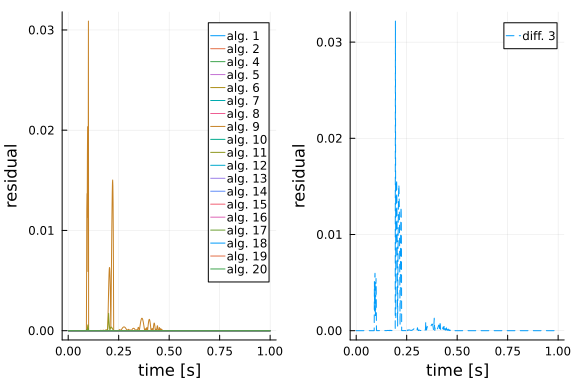


This is exactly what is computed automatically when asking for the `residual` from `ModelingToolkitTolerances`

```julia
res = residual(sol, times)
plot!(res.t, res.residuals[:,1]; label="ModelingToolkitTolerances")
```

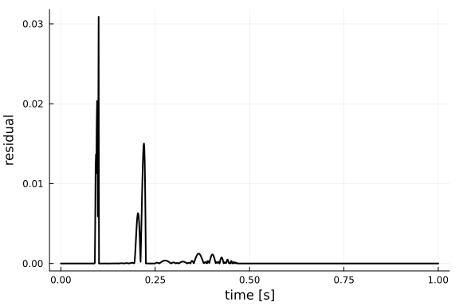


Note: calling `plot(info::ResidualInfo, settings::ResidualSettings = SUMMARY)` will plot the `norm` of all requested equations in `settings`.

Using the `analysis` function we can quickly find a better tolerance setting...

```julia
resids = analysis(prob, Tsit5())
```

```
Summary of Max Residuals
┌────────┬────────────────┬─────────────────┬─────────────────┬──────────────────┐
│ abstol │ reltol = 0.001 │ reltol = 1.0e-6 │ reltol = 1.0e-9 │ reltol = 1.0e-12 │
├────────┼────────────────┼─────────────────┼─────────────────┼──────────────────┤
│  0.001 │           2.68 │          0.0105 │         0.00779 │          0.00779 │
│ 1.0e-6 │           2.67 │         0.00241 │         1.01e-5 │          7.69e-6 │
│ 1.0e-9 │           2.67 │          0.0024 │         2.37e-6 │  *** 2.51e-8 *** │
└────────┴────────────────┴─────────────────┴─────────────────┴──────────────────┘
```


```julia
plot(resids)
```

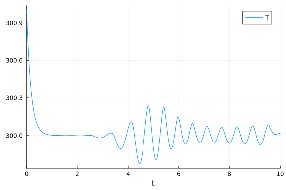


As can be seen, to get a residual less than 1 simply requires setting the `reltol` to `1e-6`.

```julia
sol = solve(prob, Tsit5(); reltol=1e-6)
plot(sol; idxs=T)
```


As can be seen, we now have a stable solution, as expected.

# Important Note
Using `saveat` can affect the quality of the `ForwardDiff.derivative` computed from the `ODESolution`.  Avoid setting this keyword when using `residual()` or `analysis()`.  

# API

```
residual(sol::ODESolution, tms = sol.t; abstol=0.0, reltol=0.0, timing=0.0)
```

Calculates residual information for `sol::ODESolution` coming from a `ModelingToolkit` model at the times `tms`, which defaults to the solved time points `sol.t`.  Returns as `ResidualInfo` object.

Keyword Arguments (used by `analysis() function`):

  * `abstol`: this simply records the `abstol` that was used to create `sol` object.  Since this information is not recorded in an `ODESolution` object it must be specified explicitly for reference.  Used by `analysis()` function.
  * `reltol`: same as above, but for `reltol`
  * `timing`: this records the corresponding solution time reference.  Used by `analysis()` function.


```
analysis(prob::ODEProblem, solver, tms = collect(prob.tspan[1]:1e-3:prob.tspan[2]); kwargs...)
```

Runs a 3 x 3 study of `abstol` and `reltol` = [1e-3, 1e-6, 1e-9].  Returns a `Vector{ResidualInfo}` which can be sent to `plot()` and `work_precision()` functions for visual analysis.  A `solver` from `OrdinaryDiffEq` must be passed as the 2nd argument.  The time points used for residual calculation are provided by `tms` and default to the `prob.tspan` spaced by 1ms.  Provided `kwargs...` are passed to the solve

